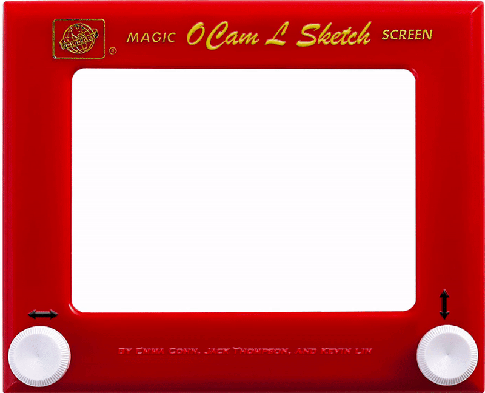

# etch-a-sketch

## installation:

`brew install Caskroom/cask/xquartz`

If installed OCaml with Homebrew:
`brew reinstall ocaml --with-x11`

`opam install graphics`
`opam install camlimages`

If installed OCaml with opam:
`opam switch reinstall 4.06.0`

## how to play:
`make play`

## gameplay controls:
`WASD` for movement

`-/=` for changing width

`1-5` for changing color

`,/.` changes speed

`p` switches to command line input

`q` quits game

## terminal commands:
`Open <filename.png> <threshold amt>`

`Open <filename.png>`

`Open <filename.json>`

`New`

`Save <filename.json>`

